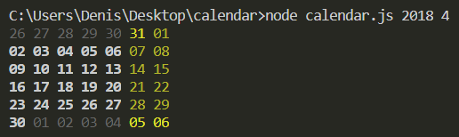

# calendar

Задача с экзамена по JS. Нужно было написать утилиту, на вход которой дается год и месяц. В качестве вывода часть отформатированного календаря. В календаре всегда 42 дня (6 недель). Праздничные, рабочие и дни не из этого месяца подсвечивались разными цветами. 

Для цветного вывода использовался [github.com/chalk](https://github.com/chalk/chalk). 

# Пример работы

